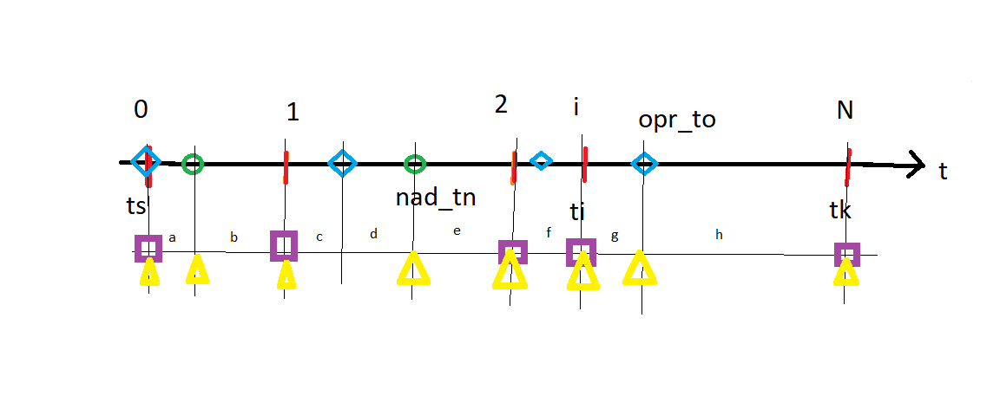

# procenty

- obliczanie raty równej i malejącej kredytu hipotecznego

# założenia

Kwota udzielona K w czasie Ts.
Spłata w N ratach miesięcznych.
Oprocentowanie zmienne.

Dodatkowo
 - realna wartosc nieruchomości w czasie
 - lokaty, obligacje
 - porównanie strategii, np. czy lokata czy nadpłata

 # Model Kredytu

 Wybierz model kredytu
    - K
    - N
    - data uruchomienia
    - daty spłaty
    - rodzaj rata (stała/malejąca)
    - oprocentowanie
    - nadplaty
    - sposob rozliczania nadplat

    Wszystkie dane powinny być zapisane do modelu

    1. ModelKredyt
    2. Kredyt : Obliczenia danych kredytu podstawowych (ModelKredyt) 

  

Celem program jest obliczenie salda kredytu w czasach $$t_0, t_1, ..., t_i, ..., t_n$$

  $$ x = {-b \pm \sqrt{b^2-4ac} \over 2a} $$

# Model Lokaty

    3. Opcjonalnie : Obliczenie Lokat (ModelLokata)
    4. Opcjonalnie, bbliczenia danych rzeczywistych

# Model Nieruchomości

    Jak zmienia się wartość nieruchomości w czasie

# Portfel

Podsumowanie powyższych. Na tej podstawie można wybrać najlepszy sposób postępowania dla kredytobiorcy.