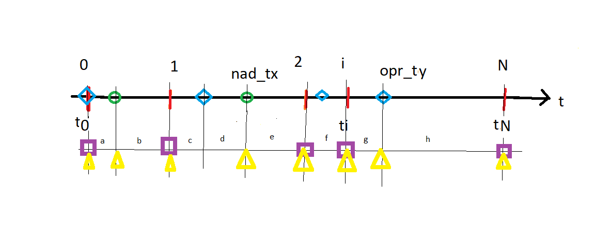

# procenty

obliczenia kredytu z ratą malejącą przy zmiennym oprocentowaniu i nadpłatach.

Dodatkowo
 - realna wartosc nieruchomości w czasie
 - lokaty, obligacje
 - porównanie strategii, np. czy lokata czy nadpłata

 # Kredyt

 Wybierz model kredytu
    - K
    - N
    - data uruchomienia
    - daty spłaty
    - rodzaj rata (stała/malejąca)
    - oprocentowanie
    - nadplaty
    - sposob rozliczania nadplat


    Wszystkie dane powinny być zapisane do modelu

    1. ModelKredyt
    2. Kredyt : Obliczenia danych kredytu podstawowych (ModelKredyt) 

  

Celem program jest obliczenie sald kredytu $$S = (s_0, s_1, s_2, ..., s_i, ..., s_N)$$  w czasach $$T = (t_0, t_1, ..., t_i, ..., t_N)$$ kiedy płacone są raty $$R = (r_1, r_2, ..., r_i, ..., r_N)$$
Czasy $T$ tworzą ciąg niemalejący, niekoniecznie o równych odstępach czasowych (kredytobiorca może zmieniać datę spłaty).
W czasie $t_0$ następuje wypłata kredytu, i zaczynają być naliczanie odsetki (dzień po dniu). W czasach $t_i$, $t_2$, ... $t_i$, $t_N$ płacone są raty. Ponieważ warunki kredytu mogą się zmieniać (oprocentowanie, nadpłaty, kary), po każdej płatności raty ponownie obliczany jest ciąg rat $R$. Po ostatniej racie $r_N$ saldo kredytu powinno wynieść $0$.

## Uruchomienie modelu

```
$ python proc.py -m nazwa_modelu
```

`nazwa_modelu` to plik `.yaml` znajdujący się w katalogu `./models`.
 
 składa się z następujących części:

 1. `K` - kapitał kredytu
 2. `start` - data uruchomienia kredytu (start naliczania odsetek)
 3. `p` - początkowa stopa procentowa kredytu
 4. lista `daty_splaty` - dni w których następuję płatność raty. Ich suma tworzy `N` - liczbę rat.
 5. opcjanalna lista zmian oprocentowania `oprocentowanie`. Każdy element listy zawiera dwie pozycje:
  - `dzien` zmiany oprocenotowania
  - `proc` nowa stopa procentowa
 6. opcjonalna lista nadpłat `nadplaty`. Każdy element listy zawiera dwie pozycje:
  - `dzien` nadpłaty
  - `kwota` nadpłaty

Przykład:
```
---
K: 460000
start: '2022-11-04'
p: 4.9

daty_splaty:
  - '2022-12-04'
  - '2023-01-04'
  - '2023-02-04'
  - '2023-03-04'
  - '2023-04-04'
...

oprocentowanie:
  - dzien: '2023-12-14'
    proc: 10.46
  - dzien: '2026-09-13'
    proc: 12

nadplaty:
  - dzien: '2023-11-03'
    kwota: 20000
  - dzien: '2025-07-01'
    kwota: 20000
    ```
## generacja modelu

p:k:r:o:s:',  ["plik=", "kapital=", "oprocentowanie=", "okresy=", "startdate="])

python generate_model.py -p nowy_model.yml -k 450000 -r 10 -o 352 -s 2022-12-28

python proc.py -m nowy_model